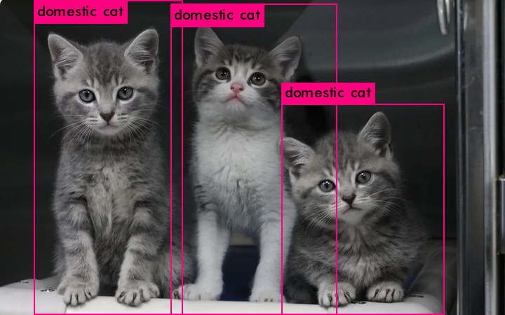

# Yolo-9000 image with GPU support

## Usage

`cd docker`
`docker-compose up -d`
`docker exec -it yolo bash`
`python3 example.py`

## Credit
* https://github.com/philipperemy/yolo-9000
* https://github.com/pjreddie/darknet